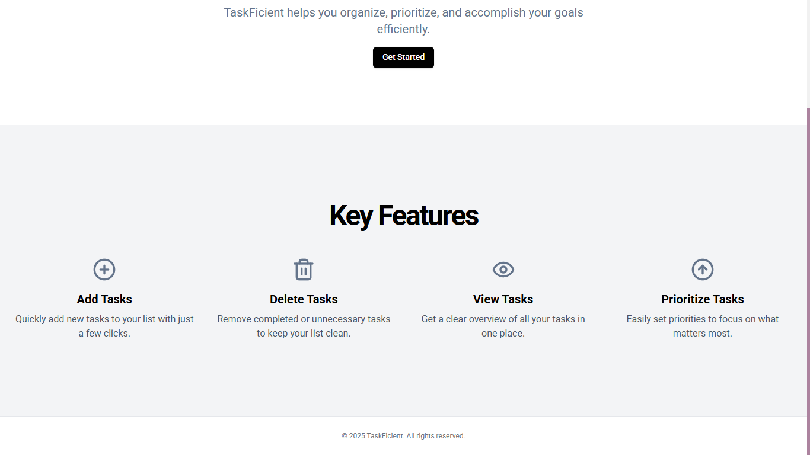
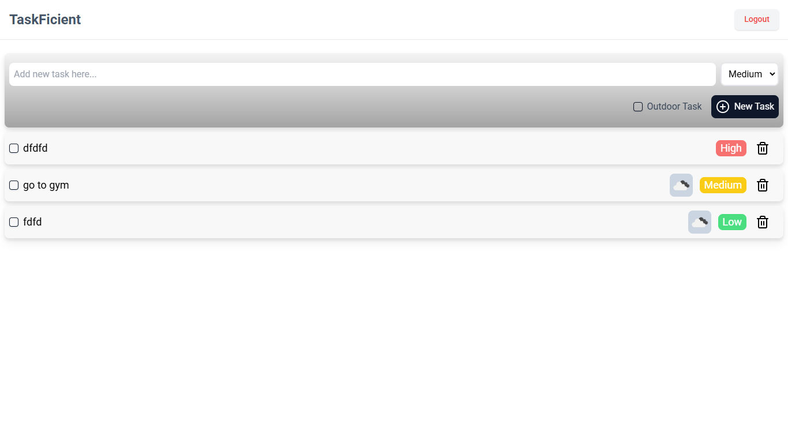
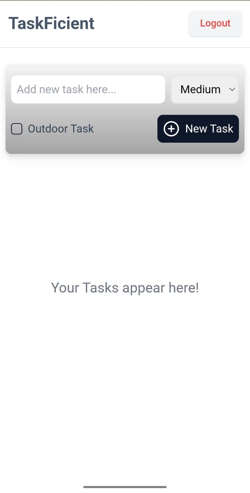
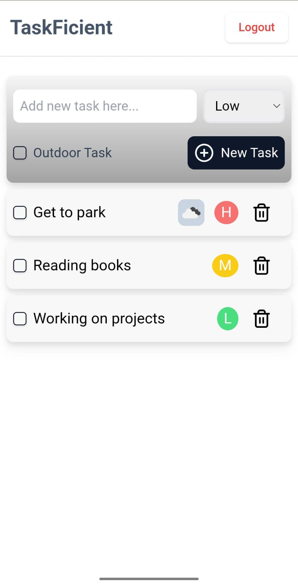

# TaskFicient

**TaskFicient** is an advanced to-do application that streamlines task management with priority sorting, real-time weather updates for outdoor activities, and a user-friendly interface. It is designed to boost productivity and ensure tasks are organized efficiently.

## Features

- **Task Management**: Add, prioritize, and track tasks effortlessly.
- **Priority Sorting**: Organize tasks based on priority levels (High, Medium, Low).
- **Real-Time Weather Integration**: Display current weather conditions for tasks marked as outdoor activities.
- **Responsive Design**: Enjoy a seamless experience across mobile, tablet, and desktop devices.
- **Mock Authentication**: Secure your tasks with a simple login/logout system.

## Installation

1. Clone the repository:

   ```bash
   git clone https://github.com/yourusername/taskficient.git

   ```

2. Navigate to the project directory:
   ```bash
   cd taskficient
   ```
3. Install the dependencies:
   ```bash
   pnpm install
   ```
4. Start the development server:
   ```bash
   pnpm dev
   ```

## Usage

- **Add Tasks**: Use the input field to add new tasks. Set a priority level and mark tasks as outdoor activities if applicable.
- **View Tasks**: View all tasks in a list, sorted by priority.
- **Delete Tasks**: Remove tasks from the list by clicking the delete icon.
- **Weather Updates**: View real-time weather icons for outdoor tasks.
- **Authentication**: Log in to manage your tasks securely.

## Screenshots








## Technologies

- **React**: Frontend framework for building user interfaces.
- **Tailwind CSS**: Utility-first CSS framework for styling.
- **Redux Toolkit**: State management library for efficient handling of application state.
- **OpenWeather API**: Weather data provider for real-time updates.

## Deployment

- **Vercel**: Deploy the application with Vercel for a seamless deployment experience.

## Contributors

Contributions are welcome! Please follow this steps:

1. Fork the repository.

2. Create a new branch:

   ```bash
   git checkout -b feature/my-feature
   ```

3. Make your changes and commit them:

   ```bash
    git commit -m 'Add my-feature'
   ```

4. Push to the original branch:

   ```bash
   git push origin feature/my-feature
   ```

5. Create the pull request.
